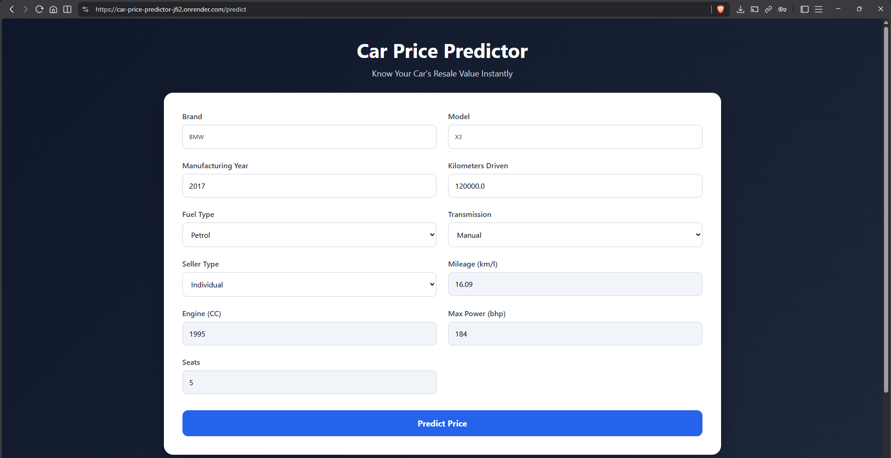
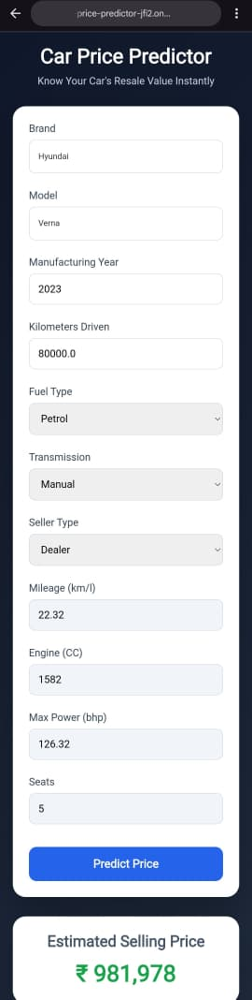

<div align="center">

# 🚗 AI Car Price Predictor

### AI-powered Used Car Resale Price Prediction using Machine Learning

Predict the resale value of used cars instantly using a trained Machine Learning model built with **Python, Flask, and Scikit-learn**.

[🌐 Live Demo](https://car-price-predictor-jfi2.onrender.com) • [📂 Source Code](https://github.com/Manav0401/AI_Car_Price_Prediction)

> **Note:** Hosted on Render's free tier. The first request may take **30–60 seconds** if the application is waking up.

</div>

---

# 📸 Application Preview

## 🏠 Homepage

<p align="center">
  
</p>

---

## 💰 Prediction Result

<p align="center">
  
</p>

---

## 📱 Mobile View

<p align="center">
  
</p>

---

# 📖 Overview

AI Car Price Predictor is a full-stack Machine Learning web application that estimates the resale value of used vehicles based on various specifications.

The application combines data preprocessing, feature engineering, model training, and a Flask-based web interface to deliver accurate predictions in real time.

---

# ✨ Features

- 🚗 Dynamic Brand & Model Selection
- 🔍 Searchable Dropdowns (Tom Select)
- ⚡ Automatic Vehicle Specification Loading
- 🤖 Machine Learning-Based Price Prediction
- 📱 Responsive User Interface
- 🎨 Modern Animated Frontend
- 💾 Pre-trained ML Model
- 📊 Instant Price Estimation

---

# 🛠 Tech Stack

| Category | Technologies |
|----------|--------------|
| **Backend** | Python, Flask |
| **Frontend** | HTML5, CSS3, JavaScript |
| **Machine Learning** | Scikit-learn, Joblib |
| **Data Processing** | Pandas, NumPy |
| **Deployment** | Render |

---

# 🧠 Machine Learning Pipeline

```
Raw Dataset
      │
      ▼
Data Cleaning
      │
      ▼
Feature Engineering
      │
      ▼
Model Training
      │
      ▼
Model Evaluation
      │
      ▼
Model Serialization
      │
      ▼
Flask Web Application
      │
      ▼
Price Prediction
```

---

# 📊 Prediction Features

The model uses the following vehicle attributes:

- Brand
- Model
- Vehicle Age
- Kilometers Driven
- Seller Type
- Fuel Type
- Transmission Type
- Mileage
- Engine Capacity
- Maximum Power
- Number of Seats

---

# 📂 Project Structure

```text
AI_Car_Price_Prediction/
│
├── app.py
├── requirements.txt
├── render.yaml
├── README.md
│
├── assets/
│   ├── homepage.png
│   ├── result.png
│   └── mobile.jpeg
│
├── data/
│   └── cleaned_dataset.csv
│
├── model/
│   └── best_model.pkl
│
├── static/
│   ├── style.css
│   └── script.js
│
└── templates/
    └── index.html
```

---

# ⚙ Installation

Clone the repository

```bash
git clone https://github.com/Manav0401/AI_Car_Price_Prediction.git
```

Move into the project

```bash
cd AI_Car_Price_Prediction
```

Install dependencies

```bash
pip install -r requirements.txt
```

Run the application

```bash
python app.py
```

Open your browser

```
http://127.0.0.1:5000
```

---

# 🚀 Live Demo

🌐 **https://car-price-predictor-jfi2.onrender.com**

---

# 🔮 Future Improvements

- User Authentication
- Prediction History
- Vehicle Image Upload
- Price Trend Analysis
- AI Recommendations
- REST API
- Dark Mode
- Market Comparison Dashboard

---

# 👨‍💻 Author

**Manav M George**

Integrated M.Tech in Artificial Intelligence  
VIT Bhopal University

GitHub: **https://github.com/Manav0401**

---

# 📌 Project Note

This project is intended for educational, research, and portfolio purposes.

---

<div align="center">

⭐ If you found this project helpful, consider giving it a star!

</div>
